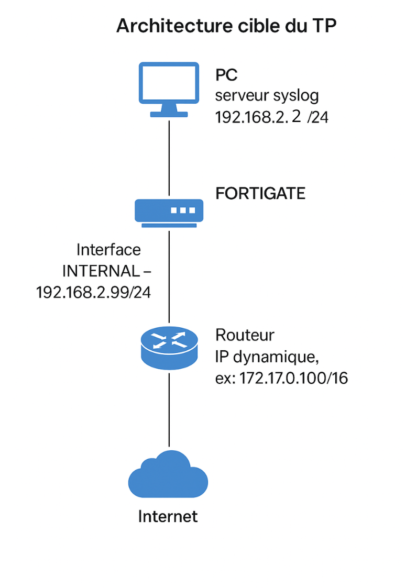

# 🔒 Fortinet Network Architecture with Multi-Administrator Management and Security

👩‍💻 **Author:** [Hadir Ben Arbia](mailto:belarbiahedir@gmail.com)  
🎓 **Cybersecurity Engineering Student**  
📅 **Academic Year:** 2024–2025  

---

## 🧠 Project Overview

This project focuses on implementing a **secure network architecture** using a **FortiGate firewall** to manage and protect communication between internal and external networks.  
It includes the configuration of multiple administrative roles, firewall security policies, and a **centralized Syslog monitoring system** based on CentOS 7.

---

## ⚙️ Virtualization Environment

- **Platform:** VMware Workstation  
- **Virtual Machines:**
  - 🧱 FortiGate (FortiOS-VM64)
  - 🖥️ CentOS 7 — Syslog Server
  - 💻 CentOS 7 — LAN Client  

---
## 🖼️ Network Topology


## 🌐 FortiGate Configuration

### 🔸 WAN Interface (port1)
- **Mode:** DHCP  
- **Role:** `wan`  
- **Alias:** `WAN`  
- **Access:** `ping`, `https`  
- **Connected to:** `VMnet8 (Bridge Mode)`

### 🔸 LAN Interface (port2)
- **IP:** `192.168.2.99/24`  
- **Role:** `lan`  
- **Alias:** `LAN`  
- **Access:** `ping`, `https`, `ssh`, `http`  
- **Connected to:** `VMnet1 (LAN)`

### ⚙️ System Configuration
```bash
config system global
  set alias "FortiOS-VM64"
  set hostname "FortiLab"
  set timezone 34
end
```
## 🌍 DNS Configuration
```bash
config system dns
  set primary 8.8.8.8
  set secondary 1.1.1.1
end
```
## 👩‍💼 Administrator Accounts & Access Profiles

| Account | Profile | Access | Authentication |
|----------|----------|---------|----------------|
| `admin` | super_admin | Read/Write | — |
| `admin2` | super_admin_readonly | Read Only | — |
| `support_admin` | super_admin_readonly | Read Only | — |
| `audit_admin` | audit_profile | Read (logs + system) | — |
| `super_admin` | prof_admin | Read/Write | 2FA via Email |

Each administrator is assigned an `accprofile` defining their access rights to system modules, enhancing control and security.

---

## 🔐 Firewall Security Policies

| ID | Name | Source | Destination | Services | Logs |
|----|------|---------|--------------|-----------|------|
| 1 | Allow_HTTP_HTTPS | port2 | port1 | HTTP, HTTPS | ✅ |
| 2 | Allow_DNS | port2 | port1 | DNS | ✅ |
| 3 | Allow_ICMP | port2 | port1 | PING | ✅ |
| 4 | Allow_FTP | port2 | port1 | FTP | ✅ |

All network activities are logged for audit and monitoring.

---

## 🧾 Syslog Server Setup (CentOS 7)

### 🧩 Installation
```bash
sudo yum install rsyslog -y
sudo systemctl start rsyslog
sudo systemctl enable rsyslog
```
## ⚙️ Configuration — `/etc/rsyslog.conf`

```bash
module(load="imudp")
input(type="imudp" port="514")

module(load="imtcp")
input(type="imtcp" port="514")
```
## 🔓 Open Ports
```bash
sudo firewall-cmd --permanent --add-port=514/udp
sudo firewall-cmd --permanent --add-port=514/tcp
sudo firewall-cmd --reload
```
## 📄 Verify Logs
```bash
tail -f /var/log/fortigate.log
```
## 📡 FortiGate Syslog Configuration
```bash
config log syslogd setting
  set status enable
  set server "192.168.2.2"
  set mode udp
  set port 514
end
```
## 📊 Results

- ✅ Centralized log collection successfully implemented via **rsyslog**  
- ✅ Administrator roles configured with restricted privileges  
- ✅ Security policies enforced for **HTTP, DNS, ICMP, and FTP**  
- ✅ Verified real-time event logging and system auditing  

---

## 🚀 Future Improvements

- 🔁 Integration of **pfSense** after FortiGate for advanced NAT and redundancy  
- 🧱 Implementation of **High Availability (HA)** configurations  
- 📈 Enhanced reporting and log analytics  
- ⚡ Optimization of routing and bandwidth management  

---

## 📎 References

- [Fortinet — FortiGate Next-Generation Firewall](https://www.fortinet.com/products/fortigate)  
- [VMware Workstation Pro](https://www.vmware.com/products/workstation-pro.html)  
- [CentOS Project](https://www.centos.org)  
- [Rsyslog Project](https://www.rsyslog.com)  

---

## 📂 Project Resources

📁 [Download the FortiGate Configuration File](https://drive.google.com/drive/folders/1vtjJVu24iSrcRjJXjlRzLUko14xxoa0G)

---


<p align="center">⭐ <b>If you found this project helpful, don’t forget to give it a star on GitHub!</b> ⭐</p>

